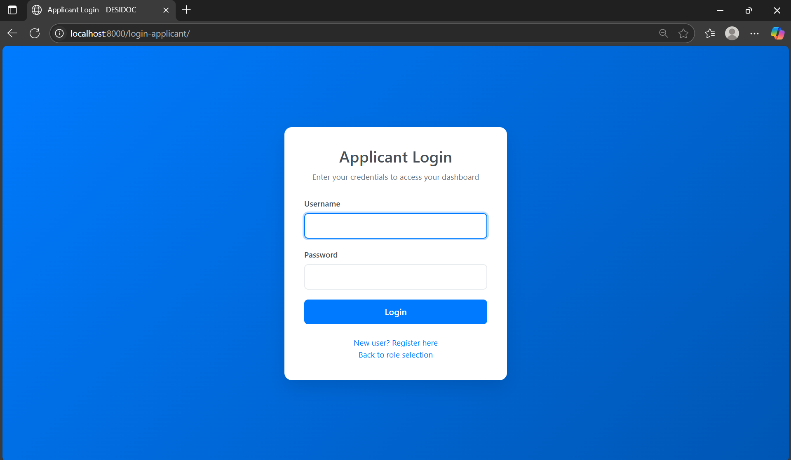
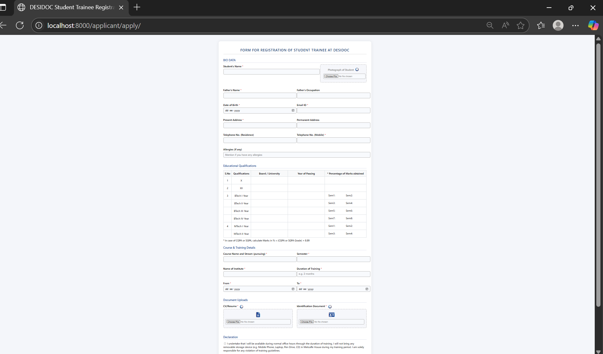

# 🛡️ DRDOc - Internship Application Portal

> A centralized digital platform to streamline internship applications for DRDO (Defence Research and Development Organisation), built using Django, MySQL, and Docker.

---

## 📌 Problem Statement

The current internship application process at DRDO relies on emails, spreadsheets, and physical documents. This leads to:
 
- 🧾 Manual handling and paper clutter  
- 🔍 Difficulty in filtering and reviewing candidates  
- 💻 No centralized storage or tracking mechanism  

---

## 💡 Our Solution — DRDOc

**DRDOc** is a secure, role-based web platform that digitizes and streamlines the internship application workflow. It offers:

- A smooth form-based interface for applicants to register and apply  
- A dashboard for HR officials to review, filter, and update application statuses  
- A Docker-based setup for consistent development and deployment  

---

## 🚀 Features

### 👩‍🎓 For Applicants:
- 🔐 Email-based registration and login  
- 📄 Application form with resume, identification doc , profile picture and signature upload
- 📬 Track application status  

### 👨‍💼 For HR/Admin:
- 📊 Dashboard to view and manage all applications  
- 🔍 Filter applicants by criteria  
- ✅ Approve or reject with status updates  

---

## 🧱 Tech Stack

| Layer        | Technology        |
|--------------|-------------------|
| Backend      | Python, Django    |
| Frontend     | HTML, CSS, JS (Django Templates) |
| Database     | MySQL             |
| Containerization | Docker & Docker Compose |
| File Storage | Django `MEDIA_ROOT` |

---

## 🐳 Docker Setup

You can run the entire project using Docker.

### 📦 Build and Run Containers

```bash
# Build the images
docker compose build

# Start the containers
docker compose up

🔗 Access the portal at: http://localhost:8000

# Stop all containers
docker compose down

# (Optional) Remove volumes for a clean state
docker compose down -v

🏠 Role-Based Home Page

📝 Applicant Registration Page

🔐 Applicant Login

🧑‍💼 HR Login

📝 HR Registration

🎓 Applicant Dashboard

📄 Application Form

📊 Status Dashboard
 
🛠️ HR Dashboard
 

👩‍💻 Authors & Contributors

👨‍💻 Praneel Tomar
Frontend Developer, Form Design, User Experience

👩‍💻 Deepti Yadav
Backend Developer, Database Management

🧑‍🏫 Mentor: Rahul Sir
Guided problem understanding, project validation, and review.

🧪 Future Enhancements
📧 Email notifications to applicants upon status updates

🧾 Automatic PDF export of biodata

🧑‍💼 Multi-admin role-based access

📈 Admin dashboard with analytics and insights


